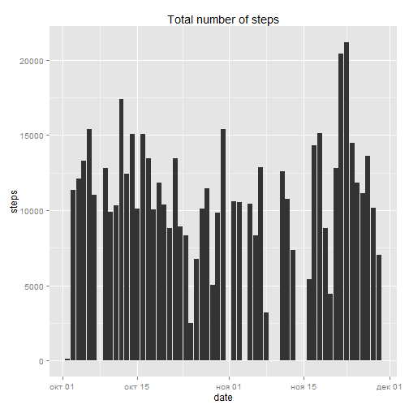
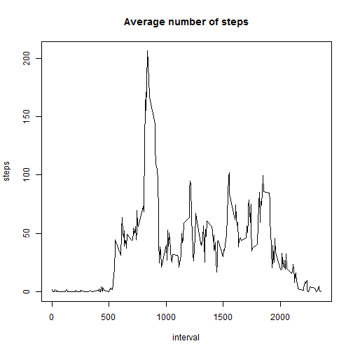

###Loading the data

```r
library(ggplot2)
activity <- read.csv("activity.csv")
activity$date <- as.Date(activity$date)
```

###What is mean total number of steps taken per day?
Calculate the total number of steps taken per day

```r
steps_per_day <- aggregate(activity$steps, by=list(date=activity$date), FUN=sum)
```

A histogram of the total number of steps taken each day

```r
ggplot(data=steps_per_day) + geom_histogram(aes(x=steps_per_day$date, y=steps_per_day$x), stat="identity") + labs(list(title = "Total number of steps", x = "date", y = "steps"))
```

```
## Warning in loop_apply(n, do.ply): Removed 8 rows containing missing values
## (position_stack).
```

 

The mean and median of the total number of steps taken per day

```r
mean_steps <- mean(steps_per_day$x, na.rm = TRUE)
median_steps <- median(steps_per_day$x, na.rm = TRUE)
```
The mean = 1.0766189 &times; 10<sup>4</sup>.
The median = 10765.

###What is the average daily activity pattern?
Calculate the average number of steps taken per 5-minute interval across all days.

```r
steps_per_interval <- aggregate(activity$steps, by=list(interval=activity$interval), FUN=mean, na.rm=TRUE)
```
Make a time series plot

```r
plot(steps_per_interval$interval, steps_per_interval$x, type='l', xlab="interval", ylab="steps", main="Average number of steps")
```

 

Which 5-minute interval, on average across all the days in the dataset, contains the maximum number of steps?

```r
steps_per_interval$interval[which.max(steps_per_interval$x)]
```

```
## [1] 835
```

###Imputing missing values
Calculate the total number of missing values in the dataset

```r
sum(is.na(activity$steps))
```

```
## [1] 2304
```
The strategy for filling in all of the missing values in the dataset:
use the mean for that 5-minute interval.
